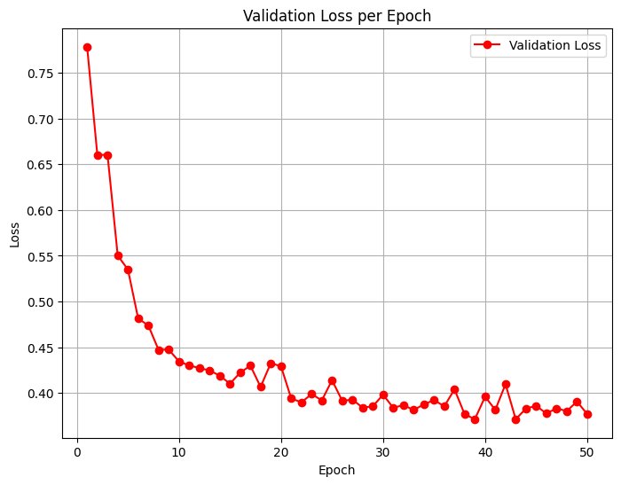
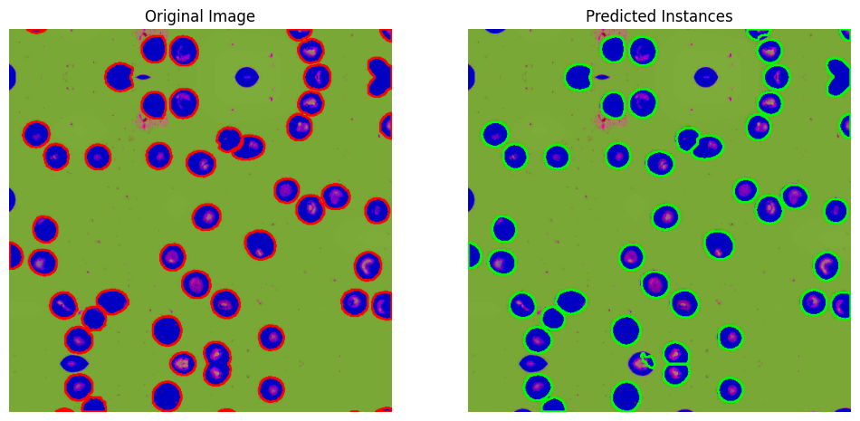
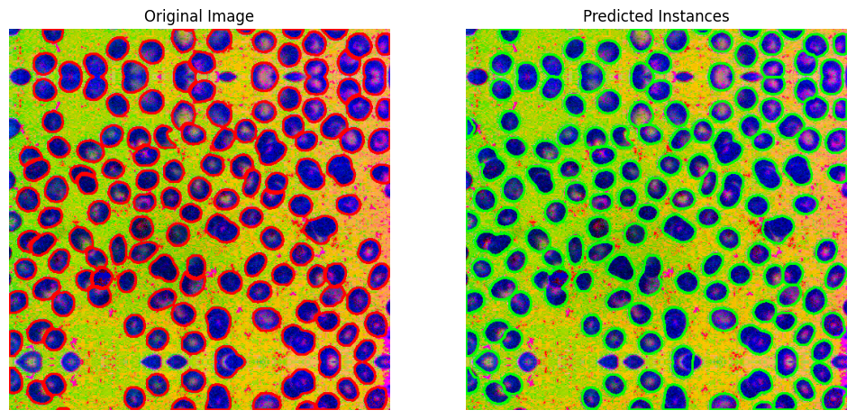
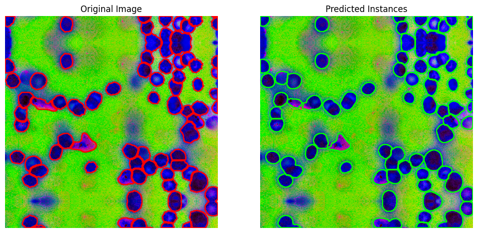
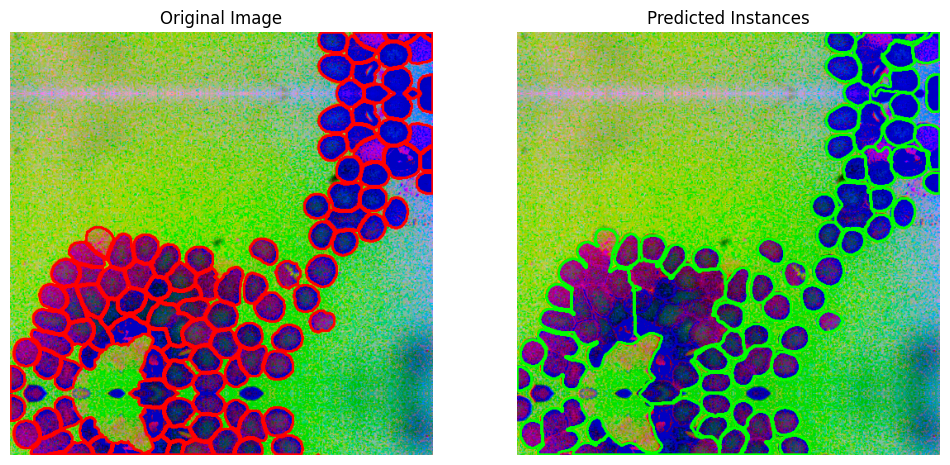
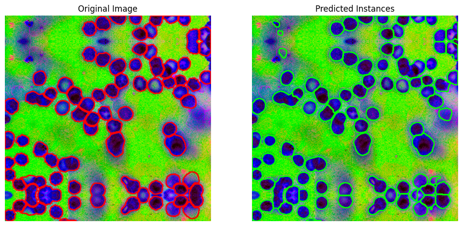

# UNI Foundation Model Adaptation for Blood Cell Instance Segmentation

*Author: Peixin* && *Date: October 2 2025*

## Model Architecture & Pathology-Driven Design Choices

### Foundation Model Selection
We adapted **UNI (ViT-L/16)** trained on >100M histopathology patches rather than generic ImageNet models. This choice is important cell morphology in blood samples shares significant structural similarities with tissue-level pathology patterns, allowing effective knowledge transfer from the pretrained backbone.

### Multi-Head Architecture
```
UNI ViT-L/16 → Feature Extraction → Lightweight Decoder → 3 Prediction Heads
                                              ├── Cell (foreground probability)
                                              ├── Boundary (edge detection) 
                                              └── Center (watershed seeds)
```

**Design Rationale:**

- **Backbone**: UNI ViT-L/16 encoder (pretrained on >100M histopathology patches). We reshape patch tokens to a spatial feature map and keep the early blocks frozen initially.
- **Decoder**: Lightweight upsampling path (Conv+GN+GELU) to reach full resolution; avoids heavy transformer decoders and keeps compute modest for 384×384 patches.
- **Multi-head outputs**: (1) foreground (cell), (2) boundary, (3) center/seedness; instances recovered via marker-controlled watershed. This mirrors common practice in nuclei segmentation to separate touching cells without an explicit detection head.


### Progressive Training Strategy
- **Epochs 1-5**: Frozen UNI backbone, train only decoder/heads (`lr_head=1e-4`)
- **Epochs 6+**: Gradual backbone unfreezing (`lr_backbone=1e-5`)
- **Rationale**: Preserve histopathology knowledge while adapting to cell-specific patterns

### Training Configuration

**Only a single 50-epoch run was performed due to time constraints. Multiple runs with hyperparameter tuning and cross-validation are needed to improve robustness and overall performance.**

### Hyperparameters
```yaml
backbone: "uni",
img_size: 512,
batch_size: 8,
epochs: 50,
lr_head: 0.0001,
lr_backbone: 1e-05,
weight_decay: 0.0001,
freeze_backbone_epochs: 5,
stain_norm: "reinhard",
augment: "strong",
num_workers: 4,
device: "cuda",


Loss Weights:
  - Cell: 1.0 (Dice + Weighted BCE)
  - Boundary: 1.0 (BCE pos_weight=2.0 + Dice)
  - Center: 1.0 (Focal Loss, pos_weight=5.0)

Data Augmentation: Strong
  - Geometric: flip, rotation, elastic deformation
  - Photometric: brightness, contrast, HSV jitter
  - Noise: Gaussian noise, motion blur
```

### Loss Function Design
Weighted multi-objective loss combining Dice, BCE, and Focal Loss

```python
# 
# pixel weight map for cell (emphasize separation pixels)
w_map = make_pixel_weights(targets["boundary"], targets["center"],
                            self.lam_b_for_cell, self.lam_c_for_cell)

# cell: Dice + BCE(weight map)
loss_cell = self.cell_dice(out["cell"], targets["cell"]) + bce_with_logits_weighted(out["cell"], targets["cell"], weight=w_map)
loss_center = focal_bce_with_logits(out["center"], targets["center"], alpha=self.focal_alpha, gamma=self.focal_gamma)

# boundary: BCE(pos_weight) + Dice/Tversky
loss_boundary = 0.5 * bce_with_logits_weighted(out["boundary"], targets["boundary"], pos_weight=pw_b)

# The results were used next prameter to compute the total loss
MultiHeadSegLoss(
    w_cell=1.0, w_boundary=1.0, w_center=1.0,
    lam_b_for_cell=1.5, lam_c_for_cell=2.0,
    boundary_pos_weight=2.0, center_pos_weight=5.0,
    use_focal_center=True, focal_alpha=0.25, focal_gamma=2.0,
    use_tversky_for_boundary=False,
    dynamic_weights=True
)
total = self.w_cell*loss_cell + self.w_boundary*loss_boundary + self.w_center*loss_center
```
### Why These Losses?
1. Instance separation: Separate heads for cell, boundary, and center target distinct cues in dense or overlapping cells.

2. Pixel-level accuracy: Dice + weighted BCE ensures high mask overlap while emphasizing critical separation pixels.

3. Sparse targets: Focal-BCE and positive weighting prevent loss dominance by background pixels.

4. Adaptive weighting: Dynamic scaling allows the model to focus on the most challenging tasks


## Quantitative Results
You can find the full evaluation report at `runs/exp001/eval_test/report.md` or 'runs/exp001/eval_test/metrics.json'.

| Metric | Value |
|---|---:|
| Mean IoU | 0.9118 |
| Mean Dice | 0.9535 |
| mAP@[0.50:0.95] | 0.3196 |
| AP@0.50 | 0.4528 |
| AP@0.75 | 0.3301 |

*Results on Test dataset(159)*

- **Mean IoU:** Pixel-level overlap between predictions and ground truth; higher is better.  
- **Mean Dice:** Similarity between predicted and true masks; measures shape and coverage accuracy.  
- **mAP@[0.50:0.95]:** Instance-level detection across multiple IoU thresholds; lower values indicate merged or missed cells.  
- **AP@0.50:** Average precision at a lenient IoU; moderate performance shows some correct detections with false positives/negatives.  
- **AP@0.75:** Average precision at a strict IoU; highlights challenges in precise instance separation, especially for small or overlapping cells.


The model achieves **high pixel-level accuracy** (Mean IoU 0.912, Mean Dice 0.954), but **instance-level performance is limited** (mAP@[0.50:0.95] 0.32, AP@0.50 0.45, AP@0.75 0.33), indicating merged or missed cells, especially for small or overlapping instances.

Next is 50 epoch validation loss curve. If you want to see training loss, please check log folder .err and .out files.



## Qualitative Analysis & Error Interpretation

### Visual Examples

Next are 5 representative test samples with varying performance. Each shows the ground truth and predicted mask. For more visualizations, please refer to `runs/exp001/eval_test/vis/` which did not include all samples due to size constraints.


**Performance**:Sample 1: IoU=0.944, Dice=0.971, mAP=0.552
  
**Performance**:Sample 2: IoU=0.929, Dice=0.963, mAP=0.354

**Performance**:Sample 3: IoU=0.894, Dice=0.944, mAP=0.281

**Performance**:Sample 4: IoU=0.913, Dice=0.954, mAP=0.187

**Performance**:Sample 5: IoU=0.874, Dice=0.933, mAP=0.280

### Success Analysis: 
- Clear cell boundaries utilize UNI's tissue architecture understanding
- Robust center detection enables accurate watershed seeding
- Minimal background noise allows clean cell foreground prediction

### Error Analysis:
- **Under-segmentation**: Overlapping cells incorrectly merged.Expecially prevalent in high-density regions. Please see all above examples,especially sample 4.
- **Boundary Confusion**: Edges fail in high-density/noisy regions; elongated or irregular cells segmented worse than round ones. Please see the above sample 2 and sample 5.
- **Over-segmentation**: Single cells fragmented, or non-cellular artifacts mislabeled as cells. Please see the above sample 5.
- **Small Cell Detection**: Performance drops with smaller cells.Sparse center predictions and weak gradients reduce accuracy.


## Key Challenges & Improvement Directions

### Current Limitations
- **Limited Hyperparameter Exploration**: The reported results are based on a single parameter configuration due to time constraints. Broader hyperparameter tuning, multiple training runs, and cross-validation have not yet been performed, which could improve robustness and performance.

- **Preprocessing**:Current color normalization (Reinhard, Macenko) may not fully capture stain variability or imaging artifacts. Standard normalization can fail to optimally enhance contrast in variable staining conditions, resulting in inconsistent segmentation. Augmentation strategies also require refinement to better reflect real-world blood smear variations.

- **Dense Cell Handling**: The watershed-based strategy struggles with overlapping and clustered cells. This is particularly problematic in blood smears, where high-density regions are common.

- **Instance Separation Uncertainty**:Boundary detection is strongly influenced by UNI’s pretrained tissue-level patterns, which may not transfer optimally to crowded, small-scale cell environments. This leads to uncertainty in instance separation under high-density conditions.

- **Scale Generalization**: The fixed 512×512 input size constrains the receptive field. Small cells lose fine detail, while larger cells may not be fully captured within patches, limiting scale adaptability.

- **Model selection**: While UNI offers a strong pathology-informed backbone, alternative architectures (e.g., CellViT, CellSAM, Hibou, KimiaNet, or detection-driven models like YOLO-based segmentors) may provide more specialized representations for blood cell morphology.


### Proposed Improvements

**1. Data & Preprocessing:**
- **Color Normalization**: Use patch-level or GAN-based normalization (StainGAN, CycleGAN) to reduce variability in high-density regions.

- **Contrast Enhancement**: Apply CLAHE, edge-preserving denoising, or multi-scale Laplacian ,non-local means or bilateral filtering to improve visibility of edges overlapping cells,improve detection of small.

- **Augmentation**: Include synthetic dense clusters, stain perturbation, elastic deformations, and multi-scale cropping.

**2. Model**
- **Self-Supervised Pretraining**: Apply self-supervised pretraining on raw cell patches to improve feature robustness, reduce dependency on reference tiles, and mitigate domain differences between UNI’s H&E/IHC pretraining and target blood smear data.

- **Backbone Alternatives**: Explore CellViT, CellSAM, Hibou, or KimiaNet for improved feature extraction and instance separation.

- **Decoder & Head**: Implement multi-scale feature fusion and topology-aware modules to handle dense clusters.

- **Hyperparameter**: Multi-epoch hyperparameter search for learning rates, loss weights, and augmentation strength; curriculum learning for sparse center targets.

- **Training strategy**: Use k-fold cross-validation and ensemble models to improve robustness.


**3.Loss Function**


- **Boundary Head**: Use distance-transform or multi-scale Dice/Tversky, or topology-aware losses (clDice) to improve separation in dense clusters.

- **Center Head**: Switch from sparse seeds to Gaussian heatmaps for smoother gradients, reducing under-segmentation.

- **Cell Head**: Hard-example mining for small or fragmented cells, optional Tversky loss to reduce false negatives.

- **Dynamic Weighting**: Refine task-specific uncertainty weighting to balance boundary, center, and cell losses.


